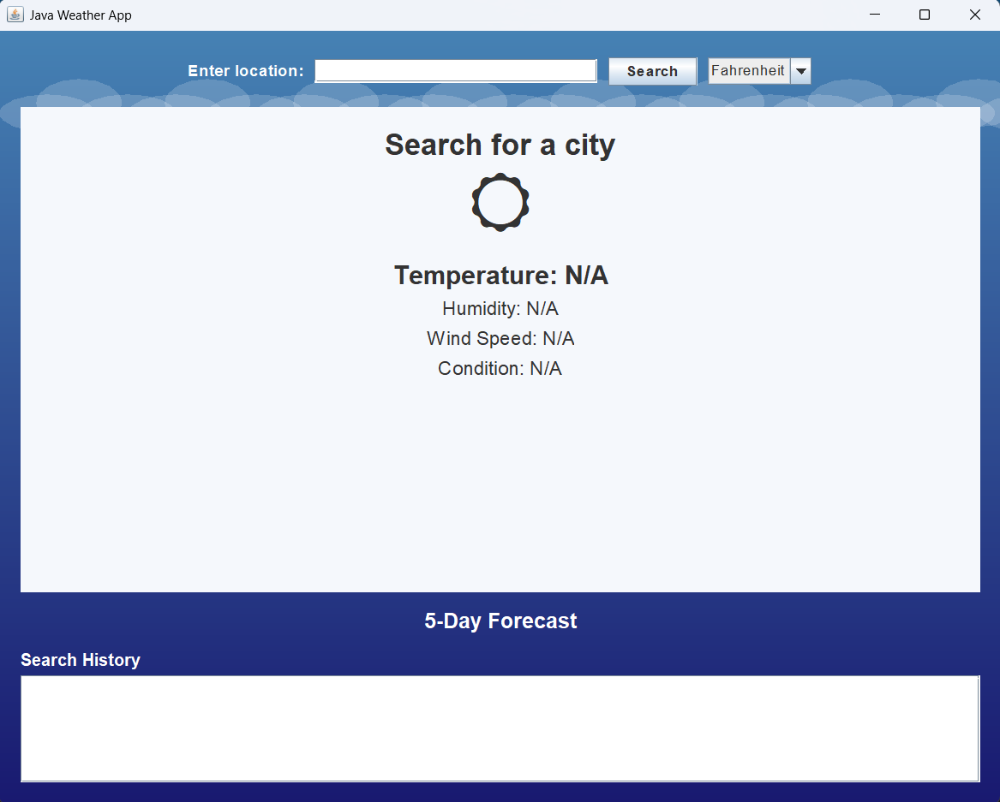
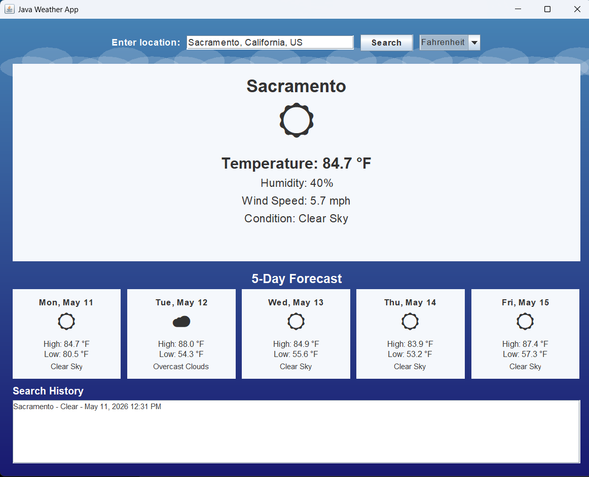

# JavaWeatherApp

JavaWeatherApp is a desktop weather application built with Java Swing. It allows users to search for a city or location and view current weather conditions, a 5-day forecast, unit conversion, city search suggestions, and recent search history.

## Screenshots

### Main Weather View



### 5-Day Forecast



## Features

- Search weather by city or location
- Supports lowercase and mixed-case city searches
- Displays current temperature, humidity, wind speed, and weather conditions
- Shows a 5-day forecast with high and low temperatures
- Supports Fahrenheit and Celsius
- Includes city search suggestions using the OpenWeatherMap Geocoding API
- Maintains recent search history during the app session
- Uses a custom Swing interface with a styled background and forecast cards
- Loads the API key from a local config file instead of hardcoding it in source code

## Technologies Used

- Java
- Java Swing
- OpenWeatherMap Current Weather API
- OpenWeatherMap 5-Day Forecast API
- OpenWeatherMap Geocoding API
- org.json library
- Eclipse IDE

## Project Structure

```text
JavaWeatherApp
├── config.example.properties
├── lib
│   └── json-20251224.jar
├── screenshots
│   ├── main-weather-view.png
│   └── forecast-view.png
├── src
│   └── weatherapp
│       ├── BackgroundPanel.java
│       ├── ConfigLoader.java
│       ├── DayForecast.java
│       ├── SuggestionService.java
│       ├── WeatherApp.java
│       └── WeatherService.java
├── .gitignore
└── README.md